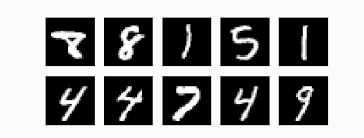

# Dataset
El conjunto de imágenes del MNIST (Modified National Institute of Standards and Technology) es muy popular entre quienes se están
adentrando al estudio del aprendizaje automático. Consiste en imágenes de dígitos dibujados (entre 0 y 9) tal como se observa en la siguiente imagen:

La idea de trabajar con este dataset es poder incursionar en modelos de machine learning, entrenándolos y ver si son capaces de reconocer un número, independiente de cómo esté dibujado. Para más información se pueden revisar los siguientes archivos:

- [PDF del proyeto](clasif&valid_cruzada.pdf)
- [Código del proyecto](clasif&valid_cruzada.py)
